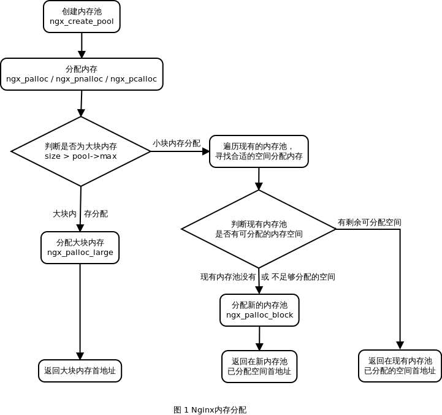
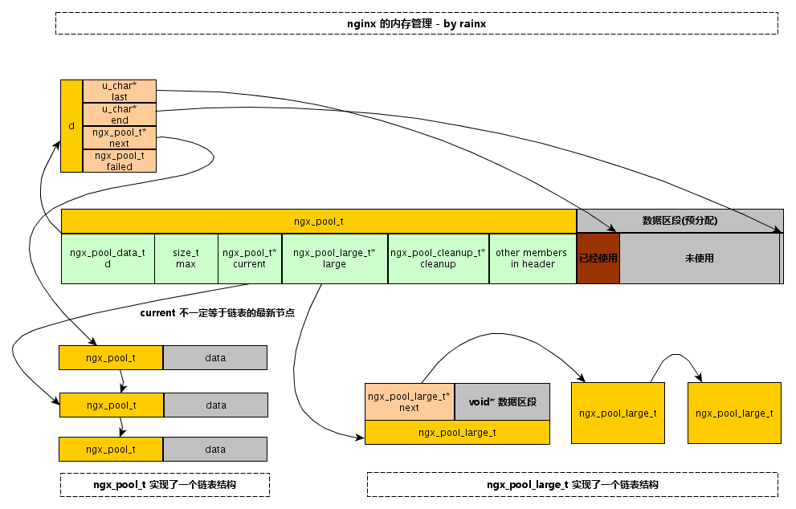

## 简介

ngx_pool_t是一个非常重要的数据结构，在很多重要的场合都有使用，很多重要的数据结构也都在使用它。那么它究竟是一个什么东西呢？简单的说，它提供了一种机制，帮助管理一系列的资源（如内存，文件等），使得对这些资源的使用和释放统一进行，免除了使用过程中考虑到对各种各样资源的什么时候释放，是否遗漏了释放的担心。

例如对于内存的管理，如果我们需要使用内存，那么总是从一个ngx_pool_t的对象中获取内存，在最终的某个时刻，我们销毁这个ngx_pool_t对象，所有这些内存都被释放了。这样我们就不必要对对这些内存进行malloc和free的操作，不用担心是否某块被malloc出来的内存没有被释放。因为当ngx_pool_t对象被销毁的时候，所有从这个对象中分配出来的内存都会被统一释放掉。

再比如我们要使用一系列的文件，但是我们打开以后，最终需要都关闭，那么我们就把这些文件统一登记到一个ngx_pool_t对象中，当这个ngx_pool_t对象被销毁的时候，所有这些文件都将会被关闭。

从上面举的两个例子中我们可以看出，使用ngx_pool_t这个数据结构的时候，所有的资源的释放都在这个对象被销毁的时刻，统一进行了释放，那么就会带来一个问题，就是这些资源的生存周期（或者说被占用的时间）是跟ngx_pool_t的生存周期基本一致（ngx_pool_t也提供了少量操作可以提前释放资源）。从最高效的角度来说，这并不是最好的。比如，我们需要依次使用A，B，C三个资源，且使用完B的时候，A就不会再被使用了，使用C的时候A和B都不会被使用到。如果不使用ngx_pool_t来管理这三个资源，那我们可能从系统里面申请A，使用A，然后在释放A。接着申请B，使用B，再释放B。最后申请C，使用C，然后释放C。但是当我们使用一个ngx_pool_t对象来管理这三个资源的时候，A，B和C的释放是在最后一起发生的，也就是在使用完C以后。诚然，这在客观上增加了程序在一段时间的资源使用量。但是这也减轻了程序员分别管理三个资源的生命周期的工作。这也就是有所得，必有所失的道理。实际上是一个取舍的问题，要看在具体的情况下，你更在乎的是哪个。

可以看一下在nginx里面一个典型的使用ngx_pool_t的场景，对于nginx处理的每个http request, nginx会生成一个ngx_pool_t对象与这个http request关联，所有处理过程中需要申请的资源都从这个ngx_pool_t对象中获取，当这个http request处理完成以后，所有在处理过程中申请的资源，都将随着这个关联的ngx_pool_t对象的销毁而释放。

ngx_pool_t相关结构及操作被定义在文件src/core/ngx_palloc.h|c中。

## 函数列表



```
ngx_pool_t *ngx_create_pool(size_t size, ngx_log_t *log);
```

创建一个初始节点大小为size的pool，log为后续在该pool上进行操作时输出日志的对象。 需要说明的是size的选择，size的大小必须小于等于NGX_MAX_ALLOC_FROM_POOL，且必须大于sizeof(ngx_pool_t)。

选择大于NGX_MAX_ALLOC_FROM_POOL的值会造成浪费，因为大于该限制的空间不会被用到（只是说在第一个由ngx_pool_t对象管理的内存块上的内存，后续的分配如果第一个内存块上的空闲部分已用完，会再分配的）。

选择小于sizeof(ngx_pool_t)的值会造成程序崩溃。由于初始大小的内存块中要用一部分来存储ngx_pool_t这个信息本身。

当一个ngx_pool_t对象被创建以后，该对象的max字段被赋值为size-sizeof(ngx_pool_t)和NGX_MAX_ALLOC_FROM_POOL这两者中比较小的。后续的从这个pool中分配的内存块，在第一块内存使用完成以后，如果要继续分配的话，就需要继续从操作系统申请内存。当内存的大小小于等于max字段的时候，则分配新的内存块，链接在d这个字段（实际上是d.next字段）管理的一条链表上。当要分配的内存块是比max大的，那么从系统中申请的内存是被挂接在large字段管理的一条链表上。我们暂且把这个称之为大块内存链和小块内存链。




## 参考

- [nginx平台初探](http://tengine.taobao.org/book/chapter_02.html)
- [Nginx 内存池管理](https://www.kancloud.cn/digest/understandingnginx/202588)